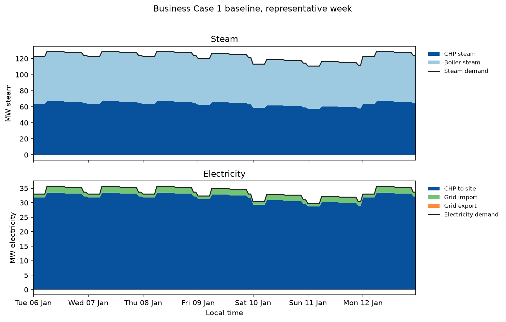
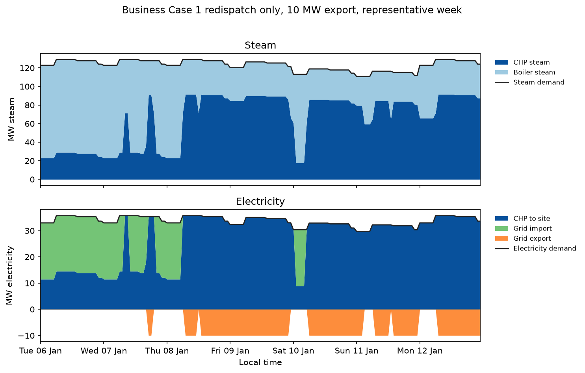
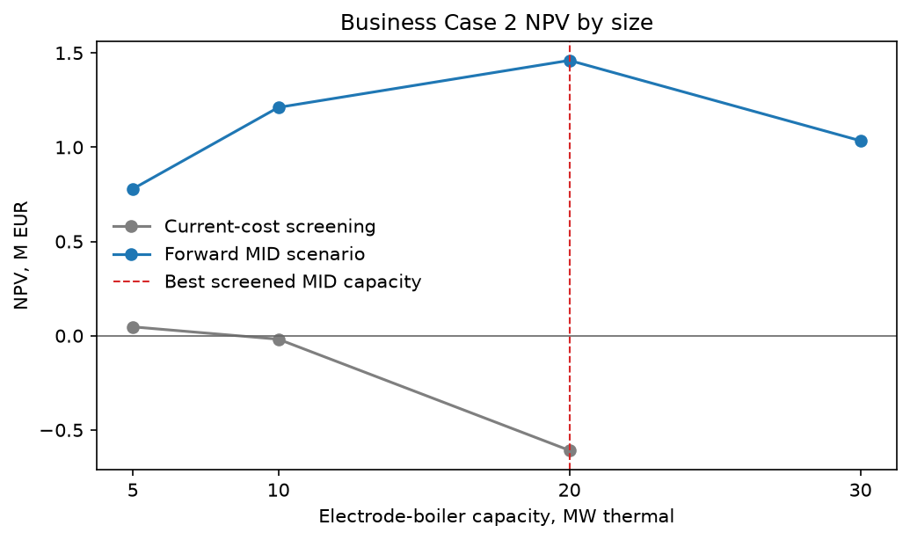
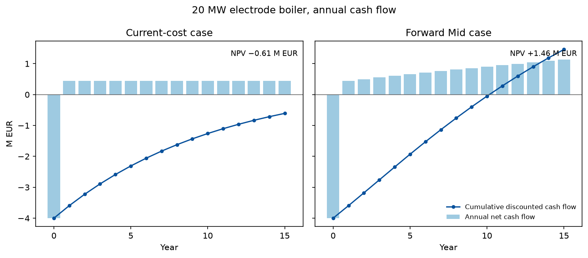

# Henkel Düsseldorf-Holthausen Energy Business Case Screening

**Code and supporting files:** [GitHub repository](https://github.com/TimFsl/rizm_case_study_henkel) 

## 1. Introduction

I enjoyed the task because it was very open. In theory, there are many different things one could investigate at a site like Düsseldorf-Holthausen. At the same time, that was also the most challenging part for me. The public information is incomplete, the real plant is complex, and within a limited amount of time I had to decide at which level of detail a model is still useful without creating false precision.

I initially had more business cases in mind. With AI support it would have been possible to build more models quickly, but every additional model would also have required more assumptions that I could not properly validate. At some point I felt that adding more detail would make it harder for me to understand and defend my own results. I therefore focused on two relatively simple cases where I understand the logic, the limitations and the main value drivers.

My approach was:

1. understand the Holthausen energy system from public information;
2. build a simple working energy balance and define the system boundary;
3. shortlist business cases that are connected to the actual site;
4. build the smallest model that can answer the main economic question;
5. express the result in EUR/t;
6. identify which real data would matter most if I were on site.

The purpose of this document is to explain that reasoning, the two models, the results and the limitations. The exact assumptions are stored in `config/assumptions.yaml`, and the sources and URLs are documented in `docs/source_register.md`.

## 2. Henkel Energy System and Düsseldorf-Holthausen Industrial Park

A difficulty I ran into early was the system boundary. Most of the technical information I found does not describe a clean Henkel-only energy system. It describes the central energy system of the Düsseldorf-Holthausen industrial site.

My understanding from the public information is roughly the following:

- Henkel operates a large heat-led CHP / combined-cycle energy system at the site.
- The site uses several steam pressure levels in reality.
- The central plant supplies electricity and process heat to Henkel, but also to other companies at the industrial site, including BASF.
- Henkel reports substantial primary energy use for electricity and heat that is sold to third parties, mainly at Düsseldorf-Holthausen.
- The site can import electricity from the public grid and can also export surplus electricity.
- Since 2026, part of the available waste heat can also be exported to Düsseldorf's district-heating system.
- For normal operation I model natural gas and biomethane. Coal and backup light fuel oil are left out of that dispatch. I do not have a source-register page that verifies a 2024 coal phase-out.
- I could not find current measured hourly electricity demand, steam demand, grid import/export, or a reliable current allocation of the central energy flows between Henkel and third parties.

The allocation problem is important. I could have estimated a percentage of the energy system that belongs to Henkel, but I did not find a reliable basis for doing so. BASF is described as a major heat consumer, so a simple proportional split between electricity and steam would also be questionable.

I therefore made a conscious simplification: the physical model represents the wider Holthausen energy system. I use Henkel production only as a denominator to calculate EUR/t. This means that the EUR/t results are site-level screening values normalized by Henkel production. They are not a claim that all modeled energy costs or savings belong to Henkel.

Based on the public information, these are the main working values I used:

| Item | Working value |
|---|---:|
| Steam / useful heat demand | ~1,040 GWh/a |
| Electricity demand | ~290 GWh/a |
| Average steam load | ~119 MWth |
| Screening grid-connection reference | ~64 MWel |
| Historical on-site electricity generation, screening band | ~260-280 GWh/a |
| Normal-operation fuel mix | 68% fossil natural gas / 32% biomethane / 0% coal |
| Henkel production used as denominator | 455,000 t/a |
| Hourly demand profiles | synthetic |

The 1,040 GWh steam demand and 290 GWh electricity demand are working estimates, not measured 2026 Henkel values. The steam total is anchored to a historical production magnitude recorded in `config/assumptions.yaml`. The ~260-280 GWh/a generation band is the same kind of screening note. Neither figure has a page in the source register. The 64 MW grid connection is a StoREN scenario capacity recorded in those assumptions. It is not a verified present contract, and it does not tell me how much electricity the site actually imports during the year.

The current natural-gas / biomethane split is not publicly disclosed. The source register has no page for the late-2023 mix or for a 2024 coal phase-out. The screening interpretation in the assumptions is an operating mix of roughly 80% gaseous fuels and 20% coal, with biomethane / biogas around 40% of the gaseous-fuel share, which is about 32% of total fuel. I then assume that coal is out of normal operation and that the former coal share was replaced by fossil natural gas while the absolute biogenic share stayed about the same. That is the 68% fossil natural gas / 32% biomethane / 0% coal split in the model. It is not a verified 2026 Henkel fuel mix. The actual biomethane share may be higher. BIO01 is a biomethane price sensitivity and does not verify this split.

For the model I simplified the real energy system to:

- one aggregated CHP block;
- one aggregated fuel-fired boiler block;
- one steam bus;
- one electricity demand;
- one steam demand;
- one grid connection with import and export.

The real site is more complex than this. I stopped at this level because a more detailed model would have required assumptions about individual turbines, minimum loads, outages, steam-header connections and part-load efficiencies that I could not validate from public data.

## 3. Business Case Selection

I wanted the business cases to meet three criteria:

1. They should be connected to the actual Holthausen energy system and not be completely generic.
2. They should address a potentially material energy lever with a model that is still simple enough to understand.
3. I wanted to be comfortable enough with the technology and the model to defend the assumptions and results.

The two cases I selected were:

- Business Case 1: CHP / boiler / grid dispatch optimization
- Business Case 2: electrode boiler / Power-to-Heat investment

There was also a practical reason for this choice. When reading the RIZM material and the Field Value Engineer role description, I saw a close connection to two parts of the Energy OS. The dispatch case is similar to a question that could come from the Operation Hub: how should existing assets be operated against market prices? The Power-to-Heat case is closer to the Decision Hub: does it make sense to invest in an additional flexible asset?

The role description also mentions a very similar industrial setup with steam consumers, a CHP, a Power-to-Heat option and waste heat. This made the two cases feel relevant to the type of problem RIZM would actually work on. More importantly, both could be built on top of the same simplified energy system.

I considered several other cases but did not develop them further.

### Spray-dryer heat recovery

Spray drying stood out because it is described as an energy-intensive process at the Düsseldorf site. My first thought was that this could be a good process-level business case.

I have seen statements that the process is highly instrumented, including a count of more than 50 sensors, and that Henkel has used exhaust-air heat recovery at other detergent plants. Those pages are not in the source register, so I do not treat the sensor count or the other-plant heat recovery as verified facts for this submission.

When I looked deeper, two things made me stop. First, I have only unverified indications that heat recovery around the Düsseldorf spray-drying process may already have been used, and that source is also absent from the register. Second, I would have needed assumptions on dryer-specific energy intensity, exhaust temperature, air flows, humidity, existing heat-recovery equipment and production throughput. I do not have much practical experience with spray dryers, so I did not think I could defend a detailed investment case confidently within the scope of this exercise.

### PV

I also considered adding PV, especially because the site appears to have large roof areas. In the end this felt too generic compared with the central CHP and steam system. It would also have introduced another investment model without adding much to the main energy-system logic I wanted to demonstrate.

### Heat pump / general waste-heat use

Another idea was to investigate whether low-grade production heat could be upgraded with a heat pump. A public discussion I found suggested that the lack of a suitable hot-water network had historically made some low-grade waste heat difficult to use economically. Without reliable source temperatures, sink temperatures and heat-demand data, I decided not to quantify this case.

### Production load shifting

Production scheduling could also create flexibility by shifting both electricity and heat demand. Spray drying would be an obvious process to investigate because it is energy intensive. However, I could not find enough public information on the electricity / thermal split, production buffers, scheduling constraints or available flexibility to quantify this case. Any numerical flexibility potential would therefore have been almost entirely invented.

The result of this screening was that I preferred two cases that are simple and transparent rather than a larger number of cases with increasingly weak assumptions.

## 4. Business Case 1: Dispatch Optimization

### 4.1 Idea

The first question I wanted to test was:

How much value could come from operating the existing CHP, boilers and grid connection differently from hour to hour?

My starting point was the heat-led nature of the site. I assume that the CHP plant produces approximately the same annual amount of electricity as the historical public data indicate. With an assumed power-to-heat ratio, this also determines the corresponding annual CHP steam production. The remaining steam demand has to be supplied by the boilers.

For the baseline operation I use a deliberately simple rule:

- CHP and boilers first cover the synthetic steam demand.
- The CHP produces electricity together with steam.
- That electricity first covers the synthetic site electricity demand.
- A shortage is imported from the grid.
- A surplus can be exported.

This is a strong simplification. In particular, the baseline does not assume a sophisticated hourly market optimization. That simplification is useful because it gives me a reference case against which I can test the value of redispatch.

The optimization can then decide hour by hour whether it is more attractive to produce more steam with CHP and less with the boilers, or the other way around, while respecting the energy balances and plant constraints.

I calculated two versions during the analysis:

- `redispatch_only`: annual CHP production stays the same as in the baseline, but the timing can change;
- `full_flex`: the optimizer can also change the annual CHP / boiler production mix within the modeled constraints.

I use `redispatch_only` as the primary case because it is the more conservative interpretation. It isolates the value of changing the timing instead of assuming that the overall role of the CHP can be redesigned.

### 4.2 Main assumptions

The main assumptions for this case are:

| Assumption | Primary value / approach |
|---|---|
| Electricity prices | observed DE/LU day-ahead prices from SMARD |
| Hourly steam demand | synthetic profile scaled to 1,040 GWh/a |
| Hourly electricity demand | synthetic profile scaled to 290 GWh/a |
| CHP annual production | calibrated to historical generation magnitude |
| CHP power-to-heat ratio | 0.50 MWh_el / MWh_th |
| CHP total efficiency | 86% |
| Boiler efficiency | 90% |
| Normal-operation fuel mix | 68% fossil natural gas / 32% biomethane |
| CHP ramp limit | 50% of CHP heat capacity per hour |
| Grid import limit | 64 MW |
| Grid export limit | 10 MW primary assumption |
| Network charges | 2025 Düsseldorf high-voltage tariff proxy |
| Production denominator | 455,000 t/a |

The synthetic demand profiles are one of the biggest limitations. I could not find current hourly demand data, so I created simple deterministic profiles that represent variation over the day, week and year while keeping the annual energy totals fixed. I also tested different profile shapes during development.

The 10 MW export limit is another important assumption. Public sources indicate that the site can export electricity, but I did not find a contracted export capacity. I therefore use 10 MW as a conservative primary value and show the sensitivity explicitly.

Business Case 1 uses the 2025 high-voltage tariff proxy, consistent with its representative 2025 operating screen. Business Case 2 is evaluated as an investment starting in 2026 and therefore uses the separate 2026 Düsseldorf high-voltage tariff assumptions.

### 4.3 Results

The primary `redispatch_only` case gives:

- annual screening value: EUR 1.986m/a
- value normalized by Henkel production: EUR 4.366/t

There is no new investment CAPEX in this case. The modeled value comes from changing the hourly operation of existing assets.

### Baseline representative week

The baseline uses the simplified heat-led operating logic described above. CHP and boilers first meet the steam demand, while CHP electricity covers site electricity demand and the grid balances the difference.

### Redispatch representative week

In the optimized redispatch case, the annual CHP production is kept fixed, but its hourly timing can change with electricity prices and the modeled operating constraints.

The figures use the synthetic 2026 demand calendar. The dispatch economics use observed 2025 DE/LU Day-Ahead prices mapped onto the model hours.

The export-capacity sensitivity is:

| Export capacity | Annual value | Value |
|---|---:|---:|
| 5 MW | ~EUR 1.28m/a | ~EUR 2.82/t |
| 10 MW | EUR 1.99m/a | EUR 4.37/t |
| 20 MW | ~EUR 3.16m/a | ~EUR 6.95/t |
| Unconstrained | ~EUR 3.27m/a | ~EUR 7.18/t |

### 4.4 Interpretation

I do not interpret the EUR 1.986m/a as a forecast of real Henkel savings. The model is too simplified for that.

What I take from the result is that there can be material value in the hourly coordination of CHP, boilers and the grid, but the value depends strongly on the actual operating constraints and the current level of market integration.

For example, the result would change if:

- the plant already reacts efficiently to electricity prices today;
- the actual export limit is much lower or higher than 10 MW;
- steam pressure levels restrict substitution between CHP and boilers;
- real CHP ramping, minimum-load or availability constraints are tighter;
- the real grid contract is different from the public tariff proxy;
- the actual load profiles look very different from my synthetic profiles.

For me, the useful output of this case is therefore not only the EUR/t number. It also shows which operational and commercial information would be most valuable to collect on site.

## 5. Business Case 2: Electrode Boiler

### 5.1 Idea

The second question was:

Would an electrode boiler make economic sense as a flexible Power-to-Heat asset at Holthausen, and what size would be worth investigating further?

My initial intuition was that an E-boiler could be interesting for this site for three reasons:

- the site has a very large steam demand;
- a flexible E-boiler can run mainly in hours when electricity is cheap;
- the effective cost of fossil steam could increase over time because of carbon costs.

In a very simple standalone calculation, the logic of an E-boiler is straightforward. It is attractive in hours where the effective electricity cost of producing one MWh of steam is below the marginal cost of producing the same steam from fuel, after accounting for efficiencies and network costs.

The investment value then depends on:

- how many such hours exist;
- how large the cost spread is during those hours;
- how much steam the E-boiler can actually displace;
- CAPEX and OPEX;
- the grid tariff and import capacity.

I could have built a small spreadsheet with assumed future electricity prices, assumed full-load hours and an assumed electricity-to-gas spread. I decided against this because I found those inputs difficult to justify.

Instead, I reused the dispatch model from Business Case 1 and added the E-boiler as an additional asset. This has two advantages. First, it automatically considers the interaction between the E-boiler, CHP, gas boilers and grid. Second, I can use observed hourly electricity-price data instead of inventing a number of cheap hours.

For each E-boiler size I therefore compare:

- an optimized full-flex system without the E-boiler;
- the same optimized system with the E-boiler.

The difference in annual operating cost is the gross annual operating benefit of the E-boiler.

### 5.2 Main assumptions

| Assumption | Primary value / approach |
|---|---|
| E-boiler efficiency | 99% |
| Tested capacities | 5, 10, 20 MW; 30 MW additional sizing check |
| CAPEX | EUR 200k/MWth |
| Fixed O&M | 1.7% of CAPEX/a |
| Lifetime | 15 years |
| Real discount rate | 10% |
| Electricity-price shapes | observed 2023, 2024 and 2025 day-ahead prices |
| Grid import limit | 64 MW |
| Grid export limit | 10 MW |
| Network charges | public 2026 Düsseldorf high-voltage tariff |
| Fuel mix and efficiencies | same energy-system assumptions as BC1, including the 68% fossil gas / 32% biomethane screening split |

The CAPEX is a literature-based screening assumption, not a vendor quote. I also keep the public 2026 network tariff constant in real terms rather than trying to forecast future network tariffs.

### 5.3 Current-cost calculation

The first calculation asks what happens if the current effective fuel and carbon cost is held constant in real terms for the whole investment life.

For each E-boiler size I run the model on the observed 2023, 2024 and 2025 electricity-price shapes and calculate the average annual operating benefit. I then use that annual benefit as a constant real cash flow in the investment calculation.

For each size I average the annual operating savings across the observed 2023, 2024 and 2025 electricity-price shapes. In this current-cost calculation, that average is then held constant in real terms over the 15-year investment period.

The results are:

| Size | Average annual gross operating savings | Gross operating savings | NPV | Annualized investment value (EAV) |
|---|---:|---:|---:|---:|
| 5 MW | EUR 154,642/a | EUR 0.340/t | +EUR 0.047m | +EUR 0.014/t |
| 10 MW | EUR 294,509/a | EUR 0.647/t | -EUR 0.019m | -EUR 0.005/t |
| 20 MW | EUR 513,931/a | EUR 1.130/t | -EUR 0.608m | -EUR 0.176/t |

The gross operating savings show the operational value before investment CAPEX. The annualized investment value, or EAV, converts the project NPV into an equivalent constant annual economic value over the investment life and then divides it by annual production. EAV therefore includes CAPEX, fixed O&M, the full cash-flow path and discounting. I use EAV EUR/t as the main EUR/t metric for the investment case.

This result surprised me at first. I expected the E-boiler to perform better because there are many low-price electricity hours. The main reason is that electricity has to be compared with the complete marginal steam cost, including the commercial treatment of grid imports. Network charges reduce the number of hours in which additional electric steam is actually attractive.

Under constant current costs, only a small flexible E-boiler is approximately at break-even.

### 5.4 Forward-cost calculation

For a 15-year investment I did not find it convincing to assume that the effective fossil-steam cost stays completely flat. At the same time, forecasting hourly German electricity prices for the next 15 years would have created a much larger modeling exercise and another set of assumptions that I could not defend.

I therefore used a second, simplified scenario calculation.

The approach is:

1. Keep the observed 2023, 2024 and 2025 hourly electricity prices as three empirical market shapes.
2. Define Low, Mid and High paths for the effective fossil-fuel cost.
3. Solve the hourly E-boiler dispatch at three anchor years: 2026, 2030 and 2040.
4. Average the operating benefit across the three observed electricity-price shapes at each anchor.
5. Linearly interpolate the annual operating benefit between the anchor years.
6. Use those annual benefits in the 15-year NPV calculation.

This is not a forecast of future hourly power prices. It is a scenario test.

It also has an important limitation: electricity and gas prices in Germany are not independent. Reusing historical electricity-price shapes while changing the future fossil-fuel and carbon assumptions is therefore not a fully consistent long-term market model. I accepted this because the purpose of the exercise is to test the investment sensitivity to the future fossil-steam cost, not to forecast the German power market.

The effective fossil-fuel costs used in the scenarios are:

| Scenario | 2026 | 2030 | 2040 |
|---|---:|---:|---:|
| Low | EUR 56.13/MWh | EUR 46.13/MWh | EUR 46.13/MWh |
| Mid | EUR 56.13/MWh | EUR 62.18/MWh | EUR 70.24/MWh |
| High | EUR 56.13/MWh | EUR 78.22/MWh | EUR 110.48/MWh |

These are screening scenarios, not point forecasts. The individual gas and carbon assumptions and the sources that informed them are documented in `config/assumptions.yaml` and `docs/source_register.md`.

### 5.5 Results

For the forward Mid case, the average annual gross operating savings below are the simple average of the 15 annual gross benefits used in the investment calculation. They are not discounted.

| Size | Average annual gross operating savings | Gross operating savings | NPV | Annualized investment value (EAV) |
|---|---:|---:|---:|---:|
| 5 MW | EUR 286,122/a | EUR 0.629/t | +EUR 0.779m | +EUR 0.225/t |
| 10 MW | EUR 509,665/a | EUR 1.120/t | +EUR 1.211m | +EUR 0.350/t |
| 20 MW | EUR 870,108/a | EUR 1.912/t | +EUR 1.460m | +EUR 0.422/t |
| 30 MW | EUR 1,133,613/a | EUR 2.491/t | +EUR 1.034m | +EUR 0.299/t |

Among the tested sizes, 20 MW has the highest NPV in the Mid case. I do not interpret that as a recommended Henkel boiler size. It is the best result within this simplified screening model.

At 20 MW:

- installed capacity is about 17% of the average modeled steam load;
- annual E-boiler steam is only around 3-4% of total steam demand;
- gross annual benefit in the Mid scenario increases from about EUR 0.51m in 2026 to about EUR 0.74m in 2030 and EUR 1.20m in 2040;
- average annual gross operating savings over the 15-year investment period are about EUR 0.87m/a, or EUR 1.91/t before CAPEX;
- after CAPEX, fixed O&M and discounting, the annualized investment value is EUR 0.422/t.

So even the 20 MW case is not a replacement for the existing steam system. I see it as a flexible additional asset that can use favorable electricity hours.

The following figure compares the same 20 MW investment under constant current costs and under the Forward Mid case. It shows why the operating savings alone are not enough to judge the investment. Under current costs, the discounted cash flows do not recover the initial CAPEX. Under the Mid path they do, resulting in the positive NPV shown above.

The scenario dependence is large. In the Low path the tested investments are unattractive. In the Mid path 20 MW has a positive NPV. In the High path the value is much larger.

For me, the useful conclusion is that the E-boiler case depends strongly on two things that would need to be validated before a real investment decision:

- future electricity versus effective fossil-steam economics;
- the actual grid tariff, billed peak and available import capacity at the site.

## 6. Results Overview

| | BC1: Dispatch optimization | BC2: E-boiler |
|---|---|---|
| Type | operational change | investment |
| New CAPEX | none | yes |
| Main result | EUR 1.986m/a | 20 MW Mid: NPV EUR 1.46m |
| EUR/t metric | EUR 4.37/t annual value | EUR 0.42/t annualized investment value (EAV) |
| Main uncertainty | actual dispatch and grid/export terms | future fuel/carbon spread and grid terms |

I see BC1 mainly as a near-term operational screening case. BC2 is more dependent on long-term assumptions, but it shows under which conditions Power-to-Heat becomes economically interesting.

## 7. First On-Site Visit

### Data request

If I could ask for one dataset first, it would be:

12 months of 15-minute energy-center historian data with aligned timestamps for grid import/export, CHP electrical output, CHP steam output, boiler steam output and the main steam demand.

This single dataset would replace several of the largest assumptions in the model:

- synthetic load profiles;
- assumed CHP / boiler split;
- modeled import and export behavior;
- modeled peak demand;
- part of the uncertainty around current dispatch practice.

### Stakeholder

The first person I would want 30 minutes with is the utilities / energy-center operations lead.

The main questions I would ask are:

- What actually determines CHP versus boiler dispatch?
- Which limits are physical and which are contractual?
- What is the real export limit?
- What happens during CHP outages and maintenance?
- Which steam headers matter for substitution?
- Which grid peak is commercially relevant?
- Is electricity-price optimization already part of today's operation?

I expect that this conversation would explain several patterns in the historian data that would otherwise be easy to misinterpret.

## 8. Limitations

The main limitations are:

- the model represents the wider Holthausen energy system, not a clean Henkel-only balance;
- EUR/t uses Henkel production only as a normalization denominator;
- hourly steam and electricity demand are synthetic;
- the real multi-pressure steam system is represented as one steam bus;
- unit-level availability, minimum loads and part-load curves are not public;
- the actual Henkel grid tariff, billed peak and export contract are unknown;
- the current natural-gas / biomethane split is not publicly disclosed; 68% / 32% is a screening assumption, and the late-2023 interpretation behind it is not in the source register;
- E-boiler CAPEX is literature-based, not a vendor quote;
- future fuel and carbon paths are scenarios;
- historical electricity-price shapes are not future forecasts.

I think these limitations are acceptable for a first screening model because they are explicit and because they lead directly to a clear list of data to request on site.

## 9. Tools and Sources

I used:

- ChatGPT for research support, model framing, challenging assumptions, discussing results and editing the final written report;
- Cursor for code implementation, refactoring, testing and repository consistency checks;
- Python / pandas for data handling;
- Pyomo + HiGHS for the hourly linear optimization;
- matplotlib for figures;
- SMARD for historical German day-ahead electricity prices.

Source URLs and notes on how each source was used are documented in:

- [`docs/source_register.md`](docs/source_register.md)

Model assumptions are documented in:

- [`config/assumptions.yaml`](config/assumptions.yaml)

Frozen result tables are summarized in:

- [`docs/reporting_pack.md`](docs/reporting_pack.md)

Key result files are:

- [`outputs/tables/dispatch_export_sensitivity.csv`](outputs/tables/dispatch_export_sensitivity.csv)
- [`outputs/tables/electric_boiler_current_vs_forward.csv`](outputs/tables/electric_boiler_current_vs_forward.csv)
- [`outputs/tables/electric_boiler_forward_npv.csv`](outputs/tables/electric_boiler_forward_npv.csv)
